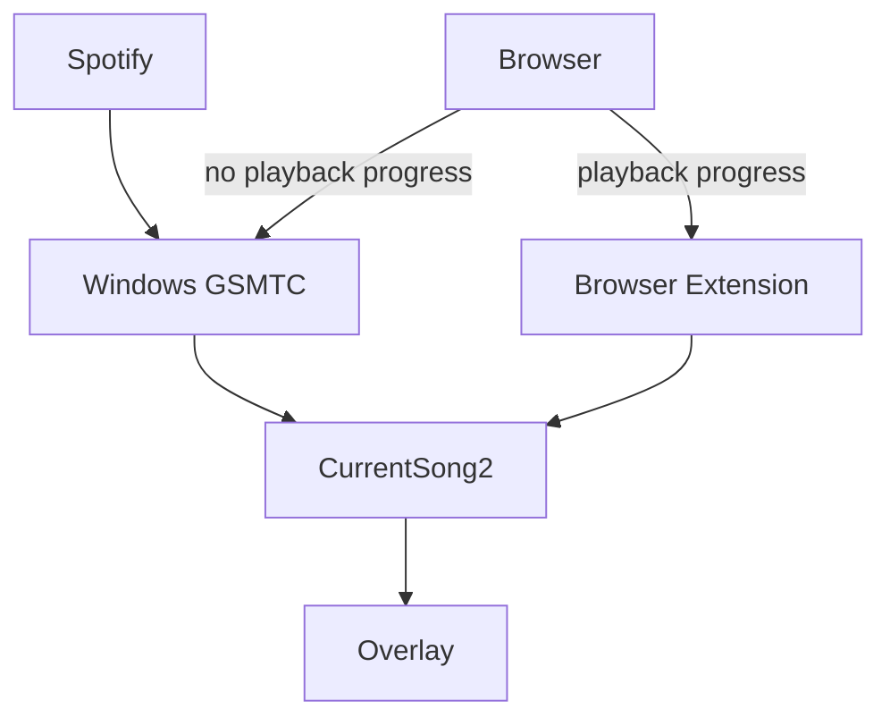

# CurrentSong 2


_For more examples, look at the [example themes](themes)!_

This project is a rewrite of the [**CurrentSong Overlay**](https://github.com/Nerixyz/current-song-overlay). The core is
written in Rust now. That doesn't change much, but now the project supports
Windows' [`GlobalSystemMediaTransportControls`](https://docs.microsoft.com/uwp/api/windows.media.control).

The goal of the project is to create a **simple yet powerful** overlay that displays the currently playing song. There
are a few unique features separating this project:

- **Near zero latency** ⏱ All modules are created with this in mind.
- **Displaying Progress** 💯 Progress is displayed where available.
- **Display Album Art** 🖼
- **Customizable** 🔧 The overlay is customizable through CSS (`theme.css`) and JavaScript (`user.js`), see [Customization](#customization). Modules and the server can be configured in
  a `config.toml` file.

## Architecture



## Setup

### Windows

- Download the latest [`current-song2.exe` from the releases tab](https://github.com/Nerixyz/current-song2/releases)
  and place it in any (preferably empty) folder.
- Run `current-song2.exe` by just double-clicking.
- On the first run, it will ask you if you want to add the application to
  autostart: 
  - If you click **Yes**, then it will add the app to autostart and start CurrentSong2 regularly. You can remove it,
    by running the app from the command line: `current-song2.exe --remove-autostart`.
  - If you click **No**, then the app will start and remember your decision in `config.toml`.
- In OBS, add a new **Browser Source** with the url set to `http://localhost:48457` (width and height should be your resolution, probably 1920x1080).
- To get extended info from your browser, install the extension [for Chrome or Edge 📦](https://chrome.google.com/webstore/detail/currentsong/alanjgmjccmkkpmpejgdhaodfjlmcone) or [for Firefox 📦](https://addons.mozilla.org/firefox/addon/current-song-overlay/).

On the first run a `config.toml` file will be created. To configure the application further,
see [Configuration](#configuration).

#### Stopping CurrentSong2

CurrentSong2 runs in the background. To stop it, open _Task Manager_, go to the _Processes_ tab and sort by _Name_ (
default setting). Search for `current-song2.exe` in the _Background Processes_ and stop the process.

**Alternatively**: In the _Task Manager_, go to _Details_ and search for `current-song2.exe`.

**If you only want to restart the app** then you can simply reopen the app, and it will ask you to stop the old instance.

#### Autostart

To remove the application from autostart, run `current-song2.exe --remove-autostart` from a terminal.

Alternatively you can **disable** the autostart entry in the Task Manager (startup tab).

## Configuration

⚠ The config is loaded at the start of CurrentSong. So in order to apply the configuration, you need to **restart** the
application. On Windows you should only need to double-click the `current-song2.exe` again, and it will ask you to stop the old process.

The configuration uses the [toml](https://toml.io) format.

The default configuration looks like this:

```toml
[modules.gsmtc]
enabled = true

[modules.gsmtc.filter]
mode = "Exclude"
items = ["chrome.exe", "msedge.exe", "firefox.exe"]

[modules.file]
enabled = true # defaults to false

[server]
port = 48457
custom_theme_path = "theme.css"
```

### `no_autostart`

This flag controls if the application will try to add itself to autostart.

- If it's `true`, then it won't add itself to autostart. _This doesn't mean it will be removed_
- If it's `false` (default), then it **will** check the autostart and possibly add itself there. You can still disable
  the entry on the _Task Manager_'s _Autostart_ tab since this is independent of the actual registry entry.

### GSMTC (Global System Media Transport Controls, Windows)

GSMTC uses Windows' own media tracking to provide metadata. However, not every application emits metadata to this system
or only limited metadata (specifically browsers; that's why they're excluded by default).

#### Filter

You can control which applications will be included in the search for metadata through `modules.gsmtc.filter`. There are
three modes: `Disabled`,`Include`, and `Exclude`:

- `Disabled` will disable all filters, and let everything pass the filters:

```toml
[modules.gsmtc.filter]
mode = "Disabled"
```

- `Include` will only include applications listed in `items`. ⚠ This list is **case-sensitive**. For example, only
  include Spotify:

```toml
[modules.gsmtc.filter]
mode = "Include"
items = ["Spotify.exe"] # ⚠ notice the capital 'S', the filter is case-sensitive
```

- `Exclude` will include everything, except applications listed in `items`. ⚠ This list is **case-sensitive**. For
  example, don't include firefox:

```toml
[modules.gsmtc.filter]
mode = "Exclude"
items = ["firefox.exe"]
```

💡 You can see the application name in the _Task Manager_ by right-clicking and selecting _Properties_.

#### `is_enabled`

Controls whether the module should be enabled or not.

### Server

#### `custom_theme_path`

Controls the path from which a CSS theme will be loaded, defaults to `theme.css`. This is indented, so that you can keep
multiple themes in the folder and switch between them.

#### `custom_script_path`

Controls the path from which a user script will be loaded, defaults to `user.js`. This is indented, so that you can keep
multiple scripts in the folder and switch between them.

#### `port`

Controls the local port on which the server is listening, defaults to `48457`.

⚠ If you change the port, make sure to change it in the extension as well.

### File Output

Current Song 2 can output the playing song to a file (disabled by default).
To enable file-output, set `modules.file.enabled` to `true`:

```toml
[modules.file]
enabled = true
path = "current_song.txt"     # default
format = "{artist} - {title}" # default
```

This will write to the file specified by `modules.file.path` (defaults to `current_song.txt`)
with the format specified by `modules.file.format` (defaults to `{artist} - {title}`).
If no song is playing, the file will be empty.

### `path`

Controls which path the application writes the song info into (relative or absolute path).
You must ensure the location exists, i.e. all folders in the path must exist.

Defaults to `curent_song.txt`.

#### `format`

Controls the format of the written text.
Interpolations are wrapped inside `{` and `}`, if you want to output a `{`, use `{{`.
These are the supported interpolations:

| Interpolation     | Description                                                                                       |
| ----------------- | ------------------------------------------------------------------------------------------------- |
| `{title}`         | The song's title.                                                                                 |
| `{artist}`        | The song's artist.                                                                                |
| `{album-name?}`   | The song's album name (or empty string).                                                          |
| `{album-tracks?}` | The album's track count (or empty string).                                                        |
| `{track-number?}` | The number of this track on the album (or empty string).                                          |
| `{source}`        | The provider of the current song. For gsmtc: `gsmtc::<executable>`, for the extension: `browser`. |
| `{duration?}`     | The song's duration (e.g. `1m23s`) (or empty string).                                             |

Defaults to `{artist} - {title}`.

## Customization

Themes and scripts _don't_ require a restart of the app, you only need to reload the browser.

💡 To debug the theme or a script, it's best to open the overlay in your browser and use its dev-tools. Go to `http://localhost:48457` in your browser.

### Theming

You can theme the overlay through a `theme.css` file (or a different filename specified in `custom_theme_path`).

📝 Take a look at the [example themes](themes)!

### Scripting

In addition to custom themes, you can customize the overlay using JavaScript through a `user.js` file (or a different filename specified in `custom_script_path`).

The script is loaded at the start.
In your script, you can expose `onPlay(state)` and `onPause()` through exports which will get called at the appropriate event.

Example:

```javascript
console.log('Hello, World!');

export function onPlay(state) {
  console.log('Hello, State!', state);
}

export function onPause() {
  console.log('Hello, Pause!');
}
```

## Building

You need to have [Rust (and Cargo)](https://www.rust-lang.org/learn/get-started) for the executable and [Node.js (and npm)](https://nodejs.org) for the overlay and extension installed.

If you don't have `pnpm` installed, install it either using the [instruction on their documentation](https://pnpm.io/installation) or though `npm`:

```sh
npm i -g pnpm
```

1. Install the dependencies

   ```sh
   pnpm i --frozen-lockfile
   ```

2. Build the extension and overlay

   ```sh
   pnpm run --if-present -r build
   ```

   This will build both projects. You can build a specific one by running `pnpm run build` in the respective folder. For example, to build the overlay, run `cd js/client && pnpm run build`. Or, you can use the `--filter` (e.g. `pnpm run --if-present -r --filter client build`).

3. Build the executable

   ```sh
   cargo build -r --locked
   ```

   This will build the executable in release mode. To build in debug mode, leave out the `-r`. For local development, it's useful to not bundle the overlay inside the executable and be able to stop the app with <kbd>CTRL</kbd> + <kbd>C</kbd>. To achieve this, add `--no-default-features` (this will disable the `single-executable` and `win32-executable` features).

## Planned Features

See more in the [projects tab](https://github.com/Nerixyz/current-song2/projects/1).

- **Better OBS Integration**
