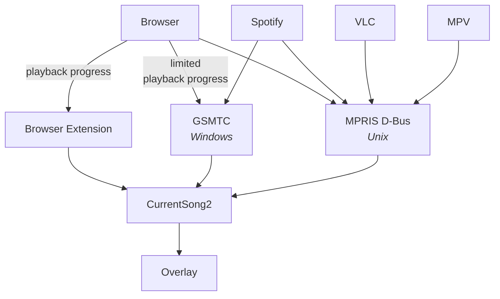

# Current Song 2

The documentation is located at [currentsong.nerixyz.de](https://currentsong.nerixyz.de).

This project is a rewrite of the [**CurrentSong Overlay**](https://github.com/Nerixyz/current-song-overlay). The core is
written in Rust now. Both Windows and Unix platforms are supported. On Windows, [`GlobalSystemMediaTransportControls`](https://docs.microsoft.com/uwp/api/windows.media.control) is used and on Unix, D-Bus is used.

The goal of the project is to create a **simple yet powerful** overlay that displays the currently playing song. There
are a few unique features separating this project:

- **Near zero latency** ⏱ Current Song 2 doesn't poll applications or APIs for updates.
- **Displaying Progress** 💯 Progress is displayed where available.
- **Display Album Art** 🖼
- **Customizable** 🔧 The overlay is customizable through CSS (`theme.css`) and JavaScript (`user.js`), see [Customization]. Modules and the server can be configured in
  a `config.toml` file, see [Configuration].

- [Setup](https://currentsong.nerixyz.de/#getting-started)
- [Configuration]
- [Customization]
- [Building](https://currentsong.nerixyz.de/Building)

## Architecture

## Planned Features

See more in the [projects tab](https://github.com/Nerixyz/current-song2/projects/1).

[Customization]: https://currentsong.nerixyz.de/Customization
[Configuration]: https://currentsong.nerixyz.de/Configuration
