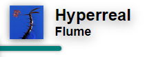

# Examples

## Repositioning

- **Right**

    ```css title="theme.css"
    #song-container {
        right: 0;
        transform-origin: right;
    }
    ```

- **Bottom left**

    ```css title="theme.css"
    #song-container {
        bottom: 0;
    }
    ```

- **Bottom right**

    ```css title="theme.css"
    #song-container {
        bottom: 0;
        right: 0;
        transform-origin: right;
    }
    ```

## Blurred Background

<figure markdown>
  
</figure>

```css title="blurerd-bg.css"
--8<-- "src/assets/themes/blurred-bg.css"
```

## Transparent Background

<figure markdown>
  
</figure>

```css title="transparent.css"
--8<-- "src/assets/themes/transparent.css"
```

## Album Line

<figure markdown>
  
</figure>

```js title="album-line.js"
--8<-- "src/assets/themes/album-line.js"
```

```css title="album-line.css"
--8<-- "src/assets/themes/album-line.css"
```

```toml title="config.toml"
[server]
custom_script_path = "album-line.js" # or paste in user.js
custom_theme_path = "album-line.css" # or paste in theme.css
```
