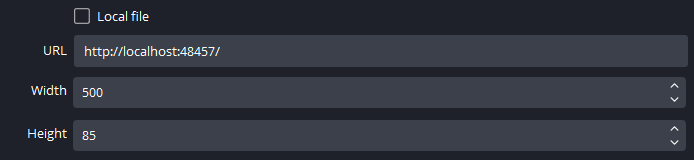

# Current Song 2

<figure markdown>
  
  <figcaption>Screenshot with default theme</figcaption>
</figure>

Welcome to Current Song 2, a customizable song overlay.
It's a rewrite of the [**CurrentSong Overlay**](https://github.com/Nerixyz/current-song-overlay). The core is
written in Rust now. That doesn't change much, but now the project supports
Windows' [`GlobalSystemMediaTransportControls`](https://docs.microsoft.com/uwp/api/windows.media.control) which allows it to capture the currently playing song of many applications on the device.

The goal of the project is to create a **simple yet powerful** overlay that displays the currently playing song. There
are a few unique features separating this project:

-   **Near zero latency** ⏱ Current Song 2 doesn't poll applications or APIs for updates.
-   **Displaying Progress** 💯 Progress is displayed where available.
-   **Display Album Art** 🖼
-   **Customizable** 🔧 The overlay is customizable through CSS (`theme.css`) and JavaScript (`user.js`), see [Customization](Customization/index.md). Modules and the server can be configured in
    a `config.toml` file, see [Configuration](Configuration.md).

## Getting Started

Currently, only Windows is fully supported. If you'd like full support for other platforms, please [open an issue](https://github.com/Nerixyz/current-song2/issues/new).

1. Download the latest [`current-song2.exe` from the releases tab](https://github.com/Nerixyz/current-song2/releases)
   and place it in any (preferably empty) folder.

2. Run `current-song2.exe` by double-clicking. This will start the backing server in the background. The server will only listen on your local computer. _To check if the app is running, navigate to [http://localhost:48457](http://localhost:48457){:target="\_blank"} in your browser. If nothing is playing, a blank page should show._

3. In OBS, add a new **Browser Source** with the URL set to `http://localhost:48457`. The default theme will have a maximum width of `500px` and height of `85px`. 

### Stopping the Server

Current Song 2 runs in the background. To stop it, open _Task Manager_, go to the _Processes_ tab and sort by _Name_ (default setting). Search for `current-song2.exe` in the _Background Processes_ section and stop the process.

**Alternatively**: In the _Task Manager_, go to _Details_ and search for `current-song2.exe`.

**If you only want to restart the app** then you can simply reopen the app, and it will ask you to stop the old instance.

### Autostart

CurrentSong2 can add itself to the autostart entries (disabled by default). To facilitate this, set the `no_autostart` option in `config.toml` to `true`.

To remove the application from autostart, run `current-song2.exe --remove-autostart` from a terminal.

Alternatively you can **disable** the autostart entry in the Task Manager (startup tab).
